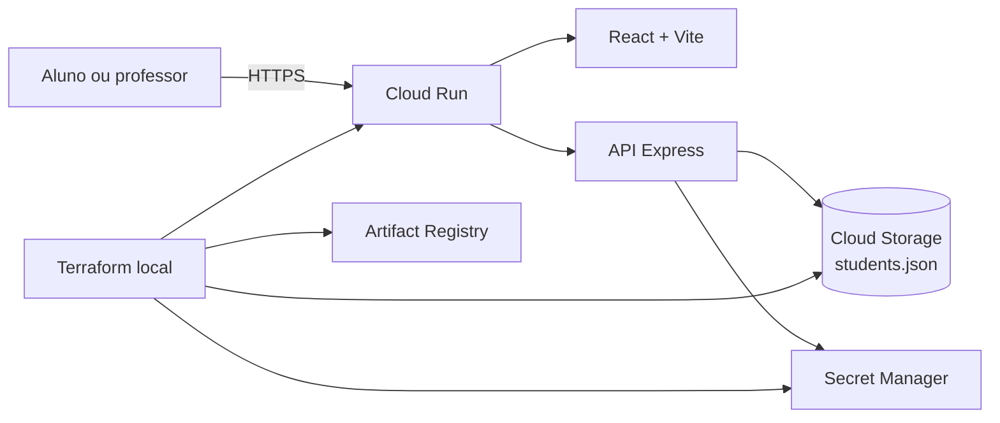

# MCA — Studios Educacionais

Plataforma interativa para o ensino de **Matemática Computacional**, organizada em estúdios temáticos nos quais o aluno aprende por experimentação, previsão, manipulação e análise de evidências.

Aplicação publicada: [matematica-computacional-qaohg26rla-rj.a.run.app](https://matematica-computacional-qaohg26rla-rj.a.run.app/)

## Visão do projeto

O MCA transforma conceitos abstratos em experiências manipuláveis. Em vez de apenas apresentar definições, cada estúdio permite que o aluno construa exemplos, altere parâmetros, formule uma previsão, observe os resultados e registre descobertas.

A experiência possui quatro modos pedagógicos comuns:

- **Aprender:** sequência guiada com explicações e previsões.
- **Explorar:** variação de parâmetros com resposta visual imediata.
- **Sandbox:** ambiente livre para experimentação.
- **Desafios:** problemas com validação, evidências e feedback.

Cada estúdio também possui uma página **Como usar**, acessível dentro da própria experiência.

## Estúdios disponíveis

| Estúdio | Rota | Experiência principal |
| --- | --- | --- |
| Conjuntos | `/sets/learn` | Operações, elementos e representação de coleções. |
| Relações | `/relations/learn` | Construção de pares e investigação de propriedades. |
| Funções | `/functions/learn` | Entradas, saídas, mapeamentos e classificações. |
| Lógica | `/logic/learn` | Construção e avaliação de expressões lógicas. |
| Tabelas-Verdade | `/truth-tables/learn` | Geração e análise de todas as valorações possíveis. |
| Equivalências | `/equivalences/learn` | Aplicação de leis de transformação lógica. |
| Lógica em Algoritmos | `/logic-algorithms/learn` | Relação entre predicados, código e fluxo de execução. |
| Circuitos Digitais | `/digital-circuits/learn` | Montagem de circuitos com portas, sinais, switches e saídas. |
| Contagem | `/counting/learn` | Princípios aditivo e multiplicativo, permutações, arranjos e combinações. |

Para abrir o guia de um estúdio, substitua o modo por `how-to`. Exemplo: `/counting/how-to`.

## Funcionalidades

- Login de alunos exclusivamente por RA, sem senha.
- Validação de RA cadastrada e ativa.
- Área administrativa protegida por chave para cadastrar, editar, ativar, desativar e excluir alunos.
- Nove experiências interativas responsivas.
- Histórico pedagógico de previsões, ações e descobertas.
- Registro local do progresso do aluno no navegador.
- Modo projetor para uso em sala de aula.
- Páginas de orientação específicas para cada estúdio.
- Persistência do cadastro de alunos em arquivo JSON no Cloud Storage.
- Interface adaptada para desktop e dispositivos móveis.

## Arquitetura



O contêiner atende tanto a aplicação React quanto a API Express. No ambiente de produção, a identidade de serviço do Cloud Run acessa o Cloud Storage e o Secret Manager sem chaves de conta de serviço armazenadas no repositório.

### Fluxo de autenticação

1. O aluno informa a RA.
2. A API normaliza a RA e consulta `students.json`.
3. Apenas uma RA existente e ativa recebe uma sessão assinada.
4. A sessão é armazenada em cookie `HttpOnly`, `SameSite=Lax` e, em produção, `Secure`.
5. A área administrativa usa uma chave separada, mantida no Secret Manager.

As tentativas de login recebem limitação por endereço de origem. As rotas administrativas também validam a função presente na sessão.

## Tecnologias

### Aplicação

- React 19 e TypeScript
- Vite
- React Router
- Zustand
- Radix UI
- React Flow
- KaTeX
- Motion e Lucide

### Servidor e qualidade

- Node.js 22 e Express 5
- Helmet
- Zod
- Vitest e Testing Library
- Playwright

### Infraestrutura

- Docker multi-stage
- Terraform
- Google Cloud Run
- Artifact Registry
- Cloud Storage
- Secret Manager
- IAM

## Estrutura do repositório

```text
.
├── e2e/                    # testes de jornada com Playwright
├── infra/                  # infraestrutura e deploy Terraform
├── public/                 # arquivos públicos da aplicação
├── server/                 # API, sessões e persistência de alunos
├── src/
│   ├── auth/               # login e administração
│   ├── components/         # componentes compartilhados e páginas HowTo
│   ├── core/               # tipos, estado e contrato pedagógico
│   ├── engines/            # motores matemáticos testáveis
│   ├── studios/            # implementação dos nove estúdios
│   └── test/               # configuração de testes
├── Dockerfile
├── package.json
├── playwright.config.ts
└── vite.config.ts
```

## Pré-requisitos

- Node.js 22 ou superior
- npm
- Google Chrome para os testes E2E
- Docker Desktop, Google Cloud CLI e Terraform para deploy

## Execução local completa

Instale as dependências e gere o frontend:

```bash
npm ci
npm run build
```

Inicie o servidor com configurações locais explícitas:

```bash
PORT=8080 \
SESSION_SECRET='troque-esta-chave-local' \
ADMIN_KEY='admin-local' \
STUDENTS_FILE='server/data/students.local.json' \
npm start
```

Acesse:

- Aplicação: [http://127.0.0.1:8080](http://127.0.0.1:8080)
- Administração: [http://127.0.0.1:8080/admin](http://127.0.0.1:8080/admin)
- Saúde do serviço: [http://127.0.0.1:8080/health](http://127.0.0.1:8080/health)

Use a chave definida em `ADMIN_KEY` para entrar na administração e cadastrar uma RA de teste. O arquivo local de alunos é criado automaticamente e não é versionado.

Para trabalhar apenas na interface com recarga automática:

```bash
npm run dev
```

Nesse modo, o Vite fica disponível em `http://127.0.0.1:5173`; os fluxos que dependem da API devem ser testados pelo servidor completo.

## Variáveis de ambiente do servidor

| Variável | Obrigatória em produção | Descrição |
| --- | --- | --- |
| `PORT` | Não | Porta HTTP; padrão `8080`. |
| `NODE_ENV` | Não | Use `production` no contêiner publicado. |
| `SESSION_SECRET` | Sim | Assina e valida as sessões. |
| `ADMIN_KEY` | Sim | Libera a autenticação administrativa. |
| `STUDENTS_BUCKET` | Sim no GCP | Bucket que contém o cadastro de alunos. |
| `STUDENTS_OBJECT` | Não | Nome do objeto; padrão `students.json`. |
| `STUDENTS_FILE` | Não | Alternativa local ao Cloud Storage. |

Nunca grave valores reais de `SESSION_SECRET`, `ADMIN_KEY`, credenciais do Google Cloud ou arquivos de estado do Terraform no Git.

## Scripts

| Comando | Finalidade |
| --- | --- |
| `npm run dev` | Inicia o Vite para desenvolvimento da interface. |
| `npm run build` | Executa TypeScript e gera o bundle de produção. |
| `npm start` | Inicia o servidor Express. |
| `npm run preview` | Visualiza o bundle com o servidor do Vite. |
| `npm test` | Executa a suíte unitária uma vez. |
| `npm run test:watch` | Executa testes em modo interativo. |
| `npm run test:e2e` | Executa as jornadas Playwright. |
| `npm run typecheck` | Valida os tipos TypeScript. |

## Testes

Execute a suíte unitária:

```bash
npm test
```

Execute o build e depois os testes de jornada:

```bash
npm run build
npm run test:e2e
```

Os testes cobrem motores matemáticos, armazenamento de alunos, sessões, abertura dos estúdios, páginas HowTo e interações pedagógicas principais.

## Contêiner local

```bash
docker build -t mca-studios-educacionais .

docker run --rm -p 8080:8080 \
  -e SESSION_SECRET='troque-esta-chave-local' \
  -e ADMIN_KEY='admin-local' \
  -e STUDENTS_FILE='/app/server/data/students.local.json' \
  mca-studios-educacionais
```

## Deploy no Google Cloud

A infraestrutura padrão utiliza o projeto `prj-box-crossfit` e a região `southamerica-east1`. Esses valores podem ser substituídos por variáveis do Terraform.

### Recursos provisionados

- APIs necessárias do Google Cloud.
- Repositório Docker no Artifact Registry.
- Serviço público no Cloud Run.
- Conta de serviço com privilégios mínimos.
- Bucket privado, versionado e protegido contra acesso público.
- Objeto `students.json` inicial.
- Segredos de administração e sessão no Secret Manager.
- Permissões IAM entre o serviço, os segredos e o bucket.

### Autenticação e aplicação

Com Docker Desktop em execução:

```bash
gcloud auth application-default login

cd infra
terraform init
terraform plan -out=tfplan
terraform apply tfplan
```

O Terraform calcula um hash dos arquivos da aplicação, constrói uma imagem imutável `linux/amd64`, envia-a ao Artifact Registry e atualiza o Cloud Run.

Consulte as saídas sem expor segredos no histórico:

```bash
terraform output application_url
terraform output admin_url
terraform output students_bucket
terraform output container_image
printf '%s\n' "$(terraform output -raw admin_access_key)"
```

Os arquivos `terraform.tfstate`, planos, cache do Terraform e credenciais locais são ignorados pelo Git. O estado deste projeto permanece local, portanto deve ser guardado com segurança para futuras operações de infraestrutura.

## Persistência e privacidade

- O Cloud Storage armazena somente nome, RA, estado ativo e metadados técnicos do cadastro.
- O progresso pedagógico permanece no navegador do aluno.
- O bucket usa versionamento e prevenção de acesso público.
- O Terraform não sobrescreve `students.json` depois da criação inicial.
- Nenhuma chave administrativa deve ser colocada no código, no README ou em commits.

## Inclusão de um novo estúdio

Para manter o contrato comum da experiência:

1. Acrescente o identificador e os metadados em `src/core/types.ts`.
2. Implemente o motor matemático em `src/engines/` e seus testes.
3. Crie o estúdio em `src/studios/` usando o scaffold compartilhado.
4. Registre o carregamento sob demanda e a rota em `src/App.tsx`.
5. Adicione o guia específico em `src/core/howTo.ts`.
6. Cubra a abertura, o HowTo e a interação principal em `e2e/studios.spec.ts`.
7. Valide testes, tipos, build, responsividade e acessibilidade antes do deploy.

## Situação atual

O projeto possui nove estúdios integrados, autenticação por RA, administração de alunos, documentação contextual e deploy automatizado por Terraform no Cloud Run.
